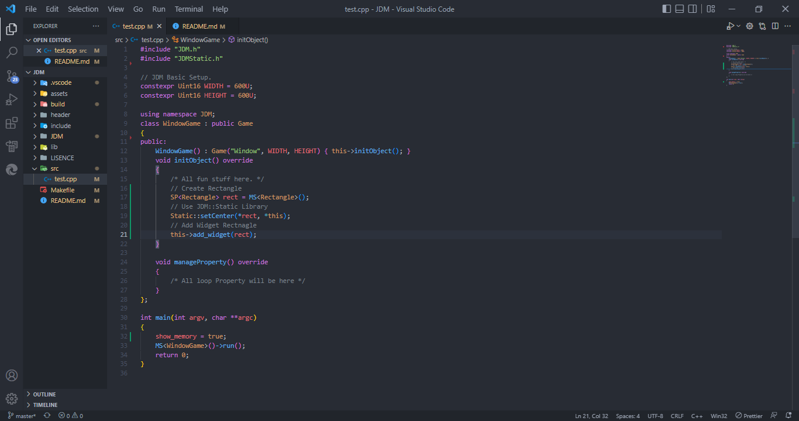

[kivy]: https://kivy.org
[sdl]: https://www.libsdl.org

# JDM

- ### <span style="color:#33FF88">JDM</span> is a basic template for [SDL]
- ### <span style="color:#33FF88">JDM</span> is inspired by [Kivy].

## Features:

```
- Widgets
- Animation
- Canvas
- Behavior
- Collision
- JDMFunction
```

# How To Use:

1. Download the <span style="color:#33FF88">JDM</span>.
2. Move the source Folder in User Folder.
3. Make sure the <span style="color:#CCFF88">JDM.bat</span> is in the path Variable.
4. Open a newly created folder <span style="color:#3388FF">vscode</span> or any ide.
5. Open <span style="color:#777777">Terminal</span>, Jump to your project path.
   ```
   $ cd C:\Folder\createdPath
   ```
6. Get the <span style="color:#CC5577">Make</span> for the project. Run the batch file or copy the <span style="color:#CC5577">Makefile</span> on your project.
   ```
   $ JDM
   ```
7. Start your project. Run <span style="color:#CC5577">Makefile</span> start.
   ```
   $ make start
   ```
   ```
    $ mingw32-make start
   ```

# JDM Capture:


